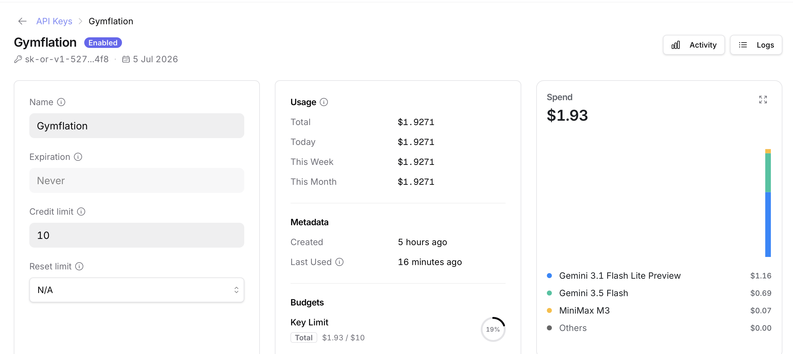

You might be familiar with super hero inflation? Over time, super hero physiques on screen have become increasingly exaggerated. Batman's progression from Adam West to Ben Affleck is a great example of this.


Gymflation is much the same idea. As gym culture has skyrocketed, it seems like so too have people's feats of strength - as recorded on social media. Going on YouTube or Instagram one gets the feeling that a 200kg deadlift is really rather average nowadays. 

But is it really true? Or are we just feeling the effects of the Algorithm, pushing extreme examples in our blue-lit faces?

What follows is a little project to find out. We will:

- Scrape the YouTube API for 10 years of deadlift personal record (PR) videos with httr2
- Use structured responses to extract the lifted weight with AI
- Evaluate the quality of our extraction and improve it with ICL
- Use a multimodal model to judge the lifter's gender
- Make extensive use of caching so errors don't set us back
- Plot our results with good old ggplot2
- Come away with a sense of tremendous satisfaction

My secret ulterior motive is that this can serve as a guide to using APIs and LLMs in an R project, demonstrating some techniques and practices that have been helpful to me. As usual the full code is below the folds.

```{r}
#| label: imports
#| code-fold: true
library(tidyverse)
library(knitr)
library(httr2)
library(ellmer)
#library(memoise)
#library(cachem)
library(caret)
```

# Scraping YouTube data with httr2 and a disk cache

The YouTube API is relatively straightforward to use with `httr2` and speaks for itself. Because the requests we need to make are GET requests, we can use the handy `req_cache` function to avoid burning quota on repeat requests.

```{r}
#| label: youtube
YOUTUBE_API_KEY <- Sys.getenv("YOUTUBE_API_KEY")

search_videos <- function(
  query,
  published_after = "2026-01-01T00:00:00Z",
  published_before = "2026-01-02T00:00:00Z"
) {
  req <- request("https://youtube.googleapis.com/youtube/v3/search") |>
    req_cache(".cache/httr2") |> # happily this endpoint is a GET so we can cache
    req_url_query(
      part = "snippet",
      q = query,
      type = "video",
      maxResults = 50,
      duration = "short",
      region = "UK",
      published_after = published_after,
      published_before = published_before,
      key = YOUTUBE_API_KEY
    ) |>
    req_headers(Accept = "application/json") |>
    req_timeout(30)

  resp <- req_perform(req)
  if (resp_is_error(resp)) {
    stop("YouTube API request failed: HTTP ", resp_status(resp))
  }

  resp_body_json(resp, simplifyVector = TRUE)
}

query <- "\"deadlift PR\" -anatoly"
```

The `-anatoly` term is to get rid of the wildly popular but irrelevant Anatoly videos. (He's an elite powerlifter who dresses as a cleaner to prank bodybuilders. Apparently the Internet can't get enough of this.)

The YouTube free API is quite restrictive so we are forced to compromise. We sample only the first day of each month, and only the first page of results (up to 50). If anyone is willing to fund my stupid research I will gladly resolve these issues.

```{r}
#| label: map-youtube
rds.file <- "data/youtube_df.rds"
df <- {
  if (file.exists(rds.file)) {
    readRDS(rds.file)
  } else {
    dates <- seq(as.Date("2015-01-01"), as.Date("2025-12-01"), by = "month")

    afters <- dates[-length(dates)]
    befores <- dates[-1]

    query_results <- purrr::map2(
      afters,
      befores,
      .f = function(a, b) {
        search_videos(
          query,
          published_after = sprintf("%sT00:00:00Z", a),
          published_before = sprintf("%sT00:00:00Z", b)
        )
      },
      .progress = TRUE
    )

    df <- query_results |>
      purrr::map(\(r) unnest(r$items, snippet)) |>
      bind_rows() |>
      mutate(publish.date = as.Date(publishedAt)) |>
      unnest(c(id, thumbnails), names_sep = ".") |>
      unnest(starts_with("thumb"), names_sep = ".") |>
      unique()
    saveRDS(df, file = rds.file, compress = FALSE)
    df
  }
}
```

Somewhow when writing this up I managed to nuke the cache. Oof. But it's not my first rodeo, I had an RDS file of the results as a fallback. Let's check out the daily result counts to ensure we haven't messed up so far.

```{r}
#| label: fig-map-youtube
#| fig-cap: Distribution of videos by date. The uniformity indicates that there are usually other pages that we haven't fetched, though it's not guaranteed that these are relevant results.
ggplot(df) +
  aes(x = publish.date) +
  geom_histogram() +
  theme_minimal() +
  labs(x = "Publish date", y = "Count of videos")
```

# Evaluating extraction accuracy

We will need to check accuracy, otherwise we've not delegated a task to AI we've delegated it to a wish and a prayer. I'm dumping a small sample into a CSV to be labelled manually, which I'd always recommend in the first instance so that you get to know your own data. 

If you need a larger sample then it could be delegated to a larger LLM than the one you are using (which may or may not equal human accuracy on this task... you may need to evaluate your evaluator...) Another approach is to (vibe) code your own labelling app so that a human can label as efficiently as possible. You can buy a labelling app like Prodigy, but in 2026 it's cheaper to spend the tokens vibe-coding something bespoke to your data. If you take this approach beware human bias too.

```{r}
#| label: dump-unannotated
set.seed(42)
df |>
  slice_sample(n = 100) |>
  select(id.videoId, title, description) |>
  write_csv("data/unannotated-weight.csv")
```

Labelling this data I discovered that sometimes people post a multi-repetition PR and include their body weight, e.g. 180x2 @ 83kg, meaning they lifted 180kg twice and their bodyweight is 83kg. We will need to account for multiple reps, because the weight will be lower. A decent approach is to use Epley's 1 Rep Max (1RM) formula to estimate the lifter's maximum for a single repetition.

```{r}
#| label: labelled
labelled <- read_csv("data/annotated-weight.csv") |>
  # putting a flag in your CSV for whether the row has been reviewed or not is helpful because you often won't label it all
  filter(reviewed) |>
  select(-reviewed)

head(labelled) |> kable()
```

We'll therefore apply two conversions: unit conversion and 1RM conversion.

```{r}
#| label: tbl-labels
#| tbl-cap: Example of labelled dataset
convert_kg <- function(weight, unit) {
  case_when(
    unit == "kg" ~ weight,
    unit == "lb" ~ weight * 0.45359237,
    .default = -1
  )
}

epley_1rm <- function(weight_kg, reps) {
  if_else(
    reps == 1,
    weight_kg,
    # rounded to nearest 0.5
    round(weight_kg * (1 + reps / 30) * 2) / 2
  )
}

labelled <- labelled |>
  mutate(
    reps = coalesce(reps, 1), # default all unspecified rep counts to 1
    weight.kg = convert_kg(weight, unit),
    weight.kg.1rm = epley_1rm(weight.kg, reps)
  )

head(labelled) |> kable()
```

The NAs are actually useful, because we want to confirm that the LLM has correctly identified these as non-extractable.

In labelling I also noticed that a small percent of cases are trap or hex bar deadlifts. This is a special type of bar that's heavier but easier to lift. We'll filter those out with a plain old regular expression.

```{r}
#| label: special
labelled <- labelled |> filter(is.na(special))
df <- df |>
  filter(!str_detect(title, "trap|hex") | str_detect(description, "trap|hex"))
```

Finally we're split the data into a test and dev set. We hold out the test set for evaluation

```{r}
#| label: splits
test <- labelled |> slice_head(n = 50)
dev <- labelled |> slice_tail(n = nrow(labelled) - 50)
tibble(nrow(test), nrow(dev)) |> kable()
```

At this point we're ready to build an extraction "model".

# Building LLM "models"

Why the quotes? Well it's very unlike modelling in the sense most people are used to. What we're going to do is advanced prompting to condition a very powerful base model into performing well on our task. Some of it speaks for itself: the system prompt sets the model up to expect a consistent input and to respond in a certain way.

The model in this case is an instance of the open source vision-language model Ministral 3B from Mistral AI, running locally via LM Studio. Running open source models locally is very easy provided your laptop has the grunt (I think you'd need at least 8GB of VRAM for this one).

Note that we specify that we're expecting a JSON response with certain keys, because we want consistent and easy-to-parse output.

```{r}
#| label: model-base
LLM_SERVER_URL <- "http://localhost:8080/v1"

extract_dl_weight_model <- function(turns = list()) {
  system_prompt <- "The user will provide the title and description of a YouTube video. If they describe a weight being deadlifted, you must extract the weight that was deadlifted, with the unit, and the number of repetitions.

Note that the deadlift world record is currently 510kg/1122lb.
Return only a JSON object with keys:

- `weight` (numeric)
- `unit` (kg, lb or NA)
- `reps` (numeric, assume 1 if not provided). 

Do not perform unit conversion.
Return NA as the unit if the description doesn't mention a weight deadlifted or the unit isn't clear."

  chat <- chat_openai_compatible(
    LLM_SERVER_URL,
    model = "mistralai/ministral-3-3b",
    credentials = function() "", # local, just ignore creds
    params = params(max_tokens = 50), # don't generate more than we need
    system_prompt = system_prompt
  )

  chat$set_turns(turns)
  chat
}
```

What's all that `set_turns` business? That's so we can prime the conversation history - more on that later.

## Structured response generation

Simply asking for JSON response is good enough most of the time, but we can do better and use structured responses to enforce it. With _Ellmer_ we can build a JSON schema describing what we want to receive. It's also an opportunity to add a description of each field for further guidance to the LLM.

```{r}
#| label: model-type
extract_dl_weight_type <- type_object(
  weight = type_number("The weight deadlifted, as a number."),
  unit = type_enum(values = c("kg", "lb", "NA")),
  reps = type_integer("Number of repetitions (1 if unspecified)")
)
```

Structured responses are quite simple: at each step, the LLM generates a probability distribution over all possible next tokens (hundreds of thousands of them). Usually we sample one from the top _k_ most likely tokens, tack it onto the end of our input and repeat. However with structured responses we only include tokens that adhere to a specified _grammar_ in the distribution, not those that would be invalid. Any grammar is possible, but JSON schema is the most popular implementation.

This works nicely, even with the fairly weak model we're using here.

```{r}
#| label: tbl-example-response
#| tbl-cap: Example response from the structured model.
example.response <- extract_dl_weight_model()$chat_structured(
  "Title: 665 lbs deadlift at 188 lbs bodyweight #deadlift #pr #powerlifting #powerlifter #usapl #ipf #shortsfeed\nDescription: ",
  type = extract_dl_weight_type
)
as_tibble(example.response) |> kable()
```

## Not wasting your life or worse, tokens

It's really handy to set up a caching mechanism. You could do this with a memoized function in code, or with a proxy. The proxy is a little easier because we can still use Ellmer's parallelisation functions easily. I have a little vibe-coded proxy that runs with Deno [here](./caching_proxy.ts). Note that most proxies won't work out-of-the-box, because chat completions are HTTP POST requests and these are not supposed to be cached because in idiomatic HTTP usage they have side-effects.

# Evaluating the model

How does our model do out of the box?

```{r}
#| label: tbl-first-eval
#| tbl-cap: Dev-set accuracy of the model with a simple system prompt.
run_extraction <- function(df, turns = list()) {
  extracted <- parallel_chat_structured(
    chat = extract_dl_weight_model(turns),
    prompts = df |>
      mutate(
        prompt = interpolate("Title: {{title}}\nDescription: {{description}}")
      ) |>
      pull(prompt),
    type = extract_dl_weight_type,
    max_active = 5
  )

  extracted |>
    mutate(
      weight.kg = convert_kg(weight, unit),
      weight.kg.1rm = epley_1rm(weight.kg, reps)
    ) |>
    bind_cols(
      select(df, id.videoId)
    )
}

extracted <- run_extraction(dev)

eval_accuracy <- function(pred, truth) {
  if (length(pred) != length(truth)) {
    stop("`pred` and `truth` must have the same length.")
  }
  matches <- pred == truth
  tibble(
    acc = sum(matches) / length(matches),
    n.positive = sum(matches),
    n.negative = length(matches) - sum(matches)
  )
}

initial.acc <- eval_accuracy(dev$weight.kg.1rm, extracted$weight.kg.1rm)
initial.acc |> kable()
```

`{r} round(initial.acc$acc, 2)` is not too bad. We can explore the failures and figure out how to improve the model.

```{r}
#| label: tbl-failures
#| tbl-cap: Extraction failures from initial model.
tibble(
  d = dev,
  e = extracted
) |>
  unnest(everything(), names_sep = ".") |>
  filter_out(d.weight.kg.1rm == e.weight.kg.1rm) |>
  kable()
```

Looks like the main failure mode is predicting a unit when none can be fairly assumed. (In practice I'm pretty sure it's primarily North American users who do this, but the safest thing is to omit these.) It also gets confused when users are too helpful and supply both units.

# Improving the model with In-Context-Learning (ICL)

We can supply examples to the model that it can learn from. This costs tokens because the prompt is longer, but reading a prompt is an order of magnitude less computationally expensive than generating output, especially with mechanisms such as KV caching.

Here I've just made up some examples that demonstrate the behaviour in tricky cases like some of the above. Let's see if it improves our accuracy on the dev set.

```{r}
#| label: tbl-icl-eval
#| tbl-cap: Accuracy of ICL-tuned model - considerably improved.
example_turn_pair <- function(title, description, weight, unit, reps) {
  list(
    UserTurn(list(ContentText(
      interpolate("Title: {{title}}\nDescription: {{description}}")
    ))),
    AssistantTurn(list(ContentText(
      interpolate(
        "{\"weight\":{{weight}}, \"unit\":\"{{unit}}\", \"reps\":{{reps}}}"
      )
    )))
  )
}

turns <- c(
  example_turn_pair(
    title = "deadlift PR 220 @ 165 bodyweight",
    description = "hit this at my meet",
    weight = 220,
    unit = "NA",
    reps = 1
  ),
  example_turn_pair(
    title = "NEW PR 585",
    description = "new deadlift personal record",
    weight = 585,
    unit = "NA",
    reps = 1
  ),
  example_turn_pair(
    title = "NEW PR 330x3",
    description = "",
    weight = 330,
    unit = "NA",
    reps = 3
  ),
  example_turn_pair(
    title = "180kg x 3 deadlift PR",
    description = "81kg 18 years old.",
    weight = 180,
    unit = "kg",
    reps = 3
  ),
  example_turn_pair(
    title = "100kg/220lb deadlift PR",
    description = "smashed it",
    weight = 100,
    unit = "kg",
    reps = 1
  ),
  example_turn_pair(
    title = "365 lb Deadlift PR @ 165 lbs",
    description = "Christal hitting a new deadlift PR @ 365 lbs, beltless. And before anyone says anything about her form, her deadlift PRs have ...",
    weight = 365,
    unit = "lb",
    reps = 1
  )
)

extracted <- run_extraction(dev, turns)
icl.acc <- eval_accuracy(dev$weight.kg.1rm, extracted$weight.kg.1rm)
icl.acc |> kable()
```

It has! A nice `{r} round(100 * (icl.acc$acc - initial.acc$acc))` percentage point improvement. Let's check against the held out test set to check that this generalises.

```{r}
#| label: icl-test-eval
#| tbl-cap: Test set accuracy of ICL-tuned model.
extracted <- run_extraction(test, turns)
eval_accuracy(test$weight.kg.1rm, extracted$weight.kg.1rm) |> kable()
```

Great. We could go deeper, and we could also be [more systematic](https://dspy.ai) about the example selection, but let's take the win.

We can now run the extraction over the whole dataset. A little tip: do that last. Work out the bugs in the end-to-end process with a sample. Otherwise you'll be drinking a lot of coffee as you watch that progress bar inch along over and over.

```{r}
#| label: full-weight-extraction
set.seed(42) # RNG is stateful
sample.df <- df |> slice_sample(n = nrow(df)) # I used n=1000 until the final runs

full.weights.file <- "data/full-weights.rds"
df.weights <- {
  if (file.exists(full.weights.file)) {
    readRDS(full.weights.file)
  } else {
    full.extraction <- run_extraction(sample.df, turns) # ☕ ☕ ☕ ☕ ☕️️️
    res <- merge(sample.df, full.extraction) |>
      mutate(
        form = if_else(
          str_detect(title, "sumo") | str_detect(description, "sumo"),
          "sumo",
          "conventional"
        ),
        year = year(publish.date)
      )
    if (nrow(res) == nrow(df)) {
      saveRDS(res, full.weights.file)
    }
    res
  }
}
df.weights <- df.weights |>
  # The extraction assigns -1 for any invalid weights, drop them now.
  filter(weight.kg.1rm > 0) |>
  # Any weight above 600 is well above the current world record, and either an extraction error or a silly post.
  filter(weight.kg.1rm < 600)
```

There's one more little step here: I've used string matching to estimate whether the deadlift was performed with conventional form or sumo form (a pose where the legs are wider and the back more upright). Later it will be interesting to compare these forms.

# First Analysis

We can now plot it and see if the "gymflation" theory holds up. I've added to overlays so that we assess the honesty of our YouTubers:

- The world record of the time, so we can spot likely noise.
- Round number imperial weights (100-1000lbs) so we can spot the rounding-up effect - similar to the phenomenon where there are suspiciously few men who report their height as 5ft 11 and suspicously many that report their height as 6ft. Though it's more reasonable in this context: why would you try for a 597.5lb deadlift when you could just go for that magic 600lbs?

```{r}
#| label: fig-first-plot
#| fig-cap: Deadlift 1RM weights over time, self-reported by YouTube users. World record lifts are points overlaid in orange. The dashed horizontal lines are round-number Imperial weights (100-1000lbs).
world.records <- read_csv("data/deadlifts.csv") |>
  mutate(weight.kg.1rm = kg, publish.date = parse_date(date, format = "%b %Y"))

hline <- function(yint.kg) {
  geom_hline(
    aes(yintercept = yint.kg),
    alpha = 0.5,
    linetype = "dashed",
    colour = "grey"
  )
}

ggplot(df.weights) +
  aes(x = publish.date, y = weight.kg.1rm) +
  geom_point(alpha = 0.9, size = 1) +
  geom_smooth() +
  geom_point(data = world.records, size = 2, colour = "orange") +
  geom_text(
    data = world.records,
    mapping = aes(label = athlete),
    nudge_y = 10,
    check_overlap = TRUE
  ) +
  hline(100 / 2.2) +
  hline(200 / 2.2) +
  hline(300 / 2.2) +
  hline(400 / 2.2) +
  hline(500 / 2.2) +
  hline(600 / 2.2) +
  hline(700 / 2.2) +
  hline(800 / 2.2) +
  hline(900 / 2.2) +
  hline(1000 / 2.2) +
  labs(x = "Date", y = "1RM weight (kg)")
```

It's readily apparent that the average weight lifted hasn't meaningfully changed. We can get a sense of whether the absolute number of heavy lifts has changed by binning.

```{r}
#| label: fig-binned-lifts
#| fig-cap: Count of videos posted over time by weight range. In recent years there are fewer deadlift PR videos in the 100-200 and 200-300 ranges - and so fewer overall.
bins <- seq(0, 600, 100)
years.range <- seq.int(
  min(df.weights$year),
  max(df.weights$year)
)

df.weights.binned <- df.weights |>
  group_by(
    year = as.integer(year),
    weight.kg.1rm.bin = cut(weight.kg.1rm, breaks = bins)
  ) |>
  summarise(n.posts = n())

index <- expand.grid(
  publish.date = years.range,
  weight.kg.1rm.bin = unique(df.weights.binned$weight.kg.1rm.bin)
)

index |>
  merge(df.weights.binned, all.x = TRUE) |>
  mutate(n.posts = coalesce(n.posts, 0)) |>
  ggplot() +
  aes(x = year, y = n.posts) +
  facet_wrap(~weight.kg.1rm.bin) +
  geom_line() +
  labs(x = "Year", y = "Videos posted") +
  scale_x_continuous(breaks = years.range) +
  theme(
    axis.text.x = element_text(angle = 90)
  )
```

If anything there are fewer videos of heavy lifts now.

Let's take a look at whether there's any apparent difference due to conventional and sumo lifting styles. This is imperfect, because not every video of a sumo deadlift will include the word "sumo". Those with "sumo" in the title or description are highly likely to be true positives, but not vice versa. Therefore we're comparing one precise distribution to a mixed distribution.

```{r}
#| label: fig-form-analysis
#| fig-cap: Distribution of deadlift 1RM weights by form (conventional vs sumo).
ggplot(df.weights) +
  aes(x = weight.kg) +
  #facet_grid(rows = vars(form), cols = vars(year), scales = "free_y") +
  facet_wrap(~form, ncol = 1, scales = "free_y") +
  geom_histogram() +
  labs(x = "1RM weight (kg)", y = "Videos posted")
```

Nonetheless, there's nothing here to suggest that conventional or sumo style makes any difference.

Besides, there's a much more obvious factor we haven't yet accounted for...

# Gender breakdown

We forgot to account for gender! We certainly expect a different distribution for each gender. But how do we identify which videos are from men and which are from women? We could try and predict gender from channel titles; some have obviously gendered names, and others like "resistance156" hint at masculinity. However there are many ambiguous names so we'll get better accuracy from visual assessment. We can use a vision-language model to predict the gender from the video thumbnails.

First we download the thumbnails. We can use parallel requests.

```{r}
#| label: tbl-download-imgs
#| tbl-cap: We are able to fetch a thumbnail image for almost all the videos.
image_path <- function(url) {
  url |>
    str_replace_all("/", "_") |>
    str_replace("https:__i.ytimg.com", "data/stills/")
}

save_image <- function(resp) {
  img_file <- gsub("/", "_", resp_url_path(resp), fixed = TRUE) |>
    str_replace("^", "posts/gymflation/data/stills/")
  con <- file(img_file, open = "wb")
  writeBin(resp_body_raw(resp), con)
  close(con)
}

df.weights.imgs <- df.weights |>
  mutate(
    image.path = image_path(thumbnails.high.url),
    downloaded = file.exists(image.path)
  )

img.reqs <- df.weights.imgs |>
  filter(!downloaded) |>
  pull(thumbnails.high.url) |>
  map(~ request(.) |> req_cache(".cache/httr2"))

img.resps <- req_perform_parallel(img.reqs)

img.resps |> map(save_image, .progress = TRUE)

df.weights.imgs$downloaded = file.exists(df.weights.imgs$image.path)

df.downloaded.only <- df.weights.imgs |> filter(downloaded)

df.weights.imgs |>
  group_by(downloaded) |>
  count() |>
  kable()
```

Now we can simply pass these to a vision model and ask it to classify gender. The same Mistral model I used earlier is capable of this task. Note that we're passing both the channel title and the image, to give the model as much information as possible.

```{r}
#| label: predict-gender-model
gender.classifier.prompt <- "The user will provide a YouTube video thumbnail of a deadlift PR. You must predict the gender of the person lifting the weight using the image and the video metadata (channel and title).
  Respond with `M` if the person appears male or `F` if the person appears female. If no real human is visible enough or if there are multiple people lifting the weight, respond with `NA`.
  Return your answer in a JSON object with a single key `gender` with value `M`, `F` or `NA`."

predict_gender_chat <- function(model = "mistralai/ministral-3-3b") {
  chat_openai_compatible(
    LLM_SERVER_URL,
    model = model,
    credentials = function() "",
    params = params(max_tokens = 1000),
    system_prompt = gender.classifier.prompt
  )
}

predict_gender_type <- type_object(
  gender = type_enum(values = c("M", "F", "NA"))
)

img_prompt <- function(row) {
  list(
    sprintf(
      "YouTube Channel: %s\nVideo title: %s",
      row$channelTitle,
      row$title
    ),
    content_image_file(row$image.path)
  )
}

# Example use
{
  prompt <- img_prompt(df.weights.imgs[1, ])
  chat <- predict_gender_chat()
  chat$chat_structured(
    prompt[[1]],
    prompt[[2]],
    type = predict_gender_type
  )
  #chat$get_tokens()
}

run_gender <- function(df.weights.imgs, chat = predict_gender_chat()) {
  prompts <- 1:nrow(df.weights.imgs) |> map(~ img_prompt(df.weights.imgs[., ]))

  preds <- parallel_chat_structured(
    chat = chat,
    prompts = prompts,
    type = predict_gender_type,
    max_active = 5
  )
  preds |>
    mutate(
      gender = if_else(gender == "NA", NA, gender)
    ) |>
    bind_cols(
      select(df.weights.imgs, id.videoId)
    )
}
```

Now we just run through another cycle of annotation, evaluation and optimisation. This time I've vibe-coded an annotation UI. Though the code for this UI is absolutely disposable, it's absolutely worth your time designing a UI that minimises cognitive load, is efficient to manipulate, and doesn't lead to mistakes.


Because the dataset is extremely unbalanced (90% of the sample were male) I've chosen to present multiple examples at once and ask the annotator to pick the ones that are _not_ male, similar to the "click all the squares with traffic lights" captchas you'll have seen. There is the risk of inattentively flipping past a non-male example, but that has to be balanced against the efficiency cost of annotating every single example. There is a back button, which in my experience is enough for those situations when your fingers move slightly faster than your brain.

An aside: I **thoroughly** recommend annotating a meaningful chunk of data yourself. The data will surprise you! In this dataset I found that male-sounding channels can feature female lifters, and that sometimes people use anime characters for the cover photo. In the past I've even found material errors in widely-used benchmark datasets (e.g. CoNLL 2003).

```{r}
#| label: tbl-annotated-stills
#| tbl-cap: The vast majority of videos feature male lifters. The video stills labelled as NA mostly did not feature any people.
df.weights.imgs |>
  select(id.videoId, channelTitle, title, image.path) |>
  jsonlite::write_json("data/stills_unannotated.json")

# Some manual annotation later...

stills.annotated <- jsonlite::read_json(
  "data/stills_annotated.json",
  simplifyVector = TRUE
) |>
  rename(
    image.path = image_path
  )

stills.annotated |> count(annotation) |> kable()
```

It took me about 30 minutes to annotate over 1000 images, which was a worthwhile investment.

In this case we'll balance the classes for evaluation. Again we will see how the model performs on the dev set before trying to optimise, and hold back the test set for the end.

```{r}
#| label: tbl-img-eval-dev
img.eval <- df.weights.imgs |>
  select(id.videoId, channelTitle, title, image.path) |>
  merge(stills.annotated)

img.eval.m <- img.eval |> filter(annotation == "M")
img.eval.f <- img.eval |> filter(annotation == "F")
img.eval.na <- img.eval |> filter(is.na(annotation))

img.eval.dev <- bind_rows(
  img.eval.m[1:10, ],
  img.eval.f[1:10, ],
  img.eval.na[1:10, ]
)
img.eval.test <- bind_rows(
  img.eval.m[11:20, ],
  img.eval.f[11:20, ],
  img.eval.na[11:20, ]
)

eval_gender_preds <- function(gender.preds, dev.set = img.eval.dev) {
  dev.set |>
    rename(gender.true = annotation) |>
    merge(
      rename(gender.preds, gender.pred = gender)
    ) |>
    replace_na(list(gender.true = "NA", gender.pred = "NA")) |>
    mutate(
      gender.true = factor(gender.true, levels = c("F", "M", "NA")),
      gender.pred = factor(gender.pred, levels = c("F", "M", "NA")),
      same = gender.true == gender.pred
    )
}

gender.preds <- run_gender(img.eval.dev)
img.eval.results.dev <- eval_gender_preds(gender.preds)

confusion <- function(results) {
  # Tiny convenience wrapper
  confusionMatrix(
    results$gender.pred,
    reference = results$gender.true,
    mode = "prec_recall"
  )
}
cm2 <- confusion(img.eval.results.dev)
cm2$table
```

The overall accuracy is `{r} round(cm2$overall[[1]], 2)`, so a good start. From the confusion matrix we can see the most common error is predicting NA for a male lifter.

We could try and boost that accuracy with ICL again, but let's check out one of the other levers available to us: model choice. We can try the exact same code with some increasingly larger VLMs.

```{r}
#| label: tbl-model-exploration
#| tbl-cap: Increasing the model size increases accuracy.
vl.models <- c(
  predict_gender_chat("mistralai/ministral-3-3b"),
  predict_gender_chat("qwen/qwen3-vl-4b"),
  predict_gender_chat("qwen/qwen3-vl-8b"),
  predict_gender_chat("qwen/qwen3-vl-30b")
)

eval_img_models <- function(models, dataset = img.eval.dev) {
  model.gender.preds <- models |>
    map(
      ~ run_gender(dataset, chat = .) |>
        mutate(model = .$get_model())
    ) |>
    bind_rows()

  results <- eval_gender_preds(model.gender.preds, dataset)
}

model.results <- eval_img_models(vl.models)
model.results |>
  group_by(model) |>
  summarise(n.same = sum(same), n.total = n(), accuracy = n.same / n.total) |>
  arrange(desc(accuracy)) |>
  kable()
```

Surprisingly the larger models do slightly worse. Looking at their confusion matrices gives us a clue.

```{r}
#| label: confusion-matrices
cms <- vl.models |>
  map(~ model.results |> filter(model == .$get_model()) |> confusion())

for (i in 1:length(vl.models)) {
  print(vl.models[[i]]$get_model())
  print(cms[[i]]$table)
}
```

The Qwen models are not abstaining (predicting NA) when they should, and the larger the model the more they under-abstain. We could at this point look at prompt-tuning or ICL, but I'm curious if there's a better option.

Let's explore the (much) wider universe of models available on [OpenRouter](https://openrouter.ai). 


## Costing

It's wise to be price-conscious: we have thousands of examples to classify, so we really want something that's less than a penny per example. I've put $10 onto my OpenRouter account.

A couple of quick tests indicate that we should expect around 500 input tokens and up to a similar amount of output tokens (when reasoning is enabled). Some napkin maths suggests that a model with an input cost of less than $0.5/M and output cost of less than $1.5/M.

In case you're wondering: consuming the input tokens is much less compute-intensive than generating the output tokens, hence the price difference.

```{r}
#| label: costing
n.examples <- nrow(df)
n.examples * (500 / 1e6 * 0.5 + 500 / 1e6 * 2) # = 7.815 USD
```

## Picking the best model for the job

If we apply this filter and sort the vision-capable models by intelligence, the top model is MiniMax M3, priced at $0.3/M input tokens and $1.2/M output tokens. We'll do a quick test to sanity check our cost estimate.

```{r}
#| label: test-minimax-cost
chat_or <- function(model) {
  chat_openrouter(
    model = model,
    system_prompt = gender.classifier.prompt,
    # chat_openrouter doesn't accept `base_url` for the proxy, but we can enable experimental response caching
    api_headers = c(
      `X-OpenRouter-Cache` = "true",
      `X-OpenRouter-Cache-TTL` = 86400 # can cache up to 24 hours
    ),
    # Explicitly enable reasoning
    api_args = list(
      reasoning = list(enabled = TRUE)
    )
  )
}

chat.minimax <- chat_or("minimax/minimax-m3")

prompt <- img_prompt(df.weights.imgs[2, ])
chat.minimax$chat_structured(
  prompt[[1]],
  prompt[[2]],
  type = predict_gender_type
)

chat_cost <- function(chat) {
  # chat$get_cost() doesn't work, but you can get at it via the raw JSON
  last.turn <- chat$last_turn()
  last.turn@json$usage$cost
}

example.cost <- chat_cost(chat.minimax)

# This may print $0 due to caching
sprintf("Est. cost %f USD", example.cost * n.examples)
```

MiniMax would cost around $2 to run the entire dataset. That's great, because my budget is $10 and I am certainly going to cock it up 5 or 6 times.

Let's see if MiniMax is actually any good though. We'll also include two proprietary models that are available on OpenRouter in Google's Gemini series. Gemini 3.5 Flash is outside our budget, but a useful reference point.

```{r}
#| label: tbl-eval-or-models
#| tbl-cap: Larger models perform slightly better.
or.model.results <- eval_img_models(
  c(
    chat_or("google/gemini-3.1-flash-lite-preview"),
    chat_or("google/gemini-3.5-flash"),
    chat_or("minimax/minimax-m3")
  )
)
or.model.results |>
  group_by(model) |>
  summarise(n.same = sum(same), n.total = n(), accuracy = n.same / n.total) |>
  kable()
```

That's better - at least as far as we can tell given how small the dataset is. MiniMax M3 is a _big_ model, at 400B params compared to just 3B for Ministral. The size of the proprietary models is unknown but presumably similar.

We haven't really done any optimisation beyond choosing models, but let's check on our held out test set all the same, lest the gods visit a plague upon our houses.

```{r}
#| label: tbl-img-test-results
#| tbl-cap: On the test set the advantage isn't so clear, suggesting that it's not the model size that's at issue.
all.models <- c(
  chat_or("google/gemini-3.1-flash-lite-preview"),
  chat_or("google/gemini-3.5-flash"),
  chat_or("minimax/minimax-m3"),
  predict_gender_chat("mistralai/ministral-3-3b"),
  predict_gender_chat("qwen/qwen3-vl-4b"),
  predict_gender_chat("qwen/qwen3-vl-8b"),
  predict_gender_chat("qwen/qwen3-vl-30b")
)
or.model.results <- eval_img_models(
  all.models,
  dataset = img.eval.test
)
or.model.results |>
  group_by(model) |>
  summarise(n.same = sum(same), n.total = n(), accuracy = n.same / n.total) |>
  kable()
```

It looks like real improvement isn't going to come from the models, it could be that the dataset is too small and messy. We could drill further, but let's move on. We'll take gemini-3.1-flash-lite-preview as apparently a good balance of performance and cost. It costs a similar amount to MiniMax M3, $0.25/M input tokens and $1.50/M output tokens.

```{r}
#| label: run-img-model
df.weights.genders <- {
  full.results.file <- "data/gender-labelled-full.rds"
  if (file.exists(full.results.file)) {
    readRDS(full.results.file)
  } else {
    gender.preds <- run_gender(
      df.weights.imgs,
      chat_or("google/gemini-3.1-flash-lite-preview")
    )
    res <- df.weights |> merge(gender.preds)
    if (nrow(res) == nrow(df.weights.imgs)) {
      saveRDS(res, full.results.file)
    }
    res
  }
}
```

Again, I'm saving this to a file. My top tip for OpenRouter would be to make project-specific API keys, each with their own limit.



## Gender results

Here's how those results look. First some sanity checks.

```{r}
#| label: tbl-gender-counts
#| tbl-cap: The predicted genders are mainly male, as you might expect in strength training.
df.weights.genders |>
  group_by(gender) |>
  count() |>
  kable()
```

The distribution of weights lifted by each gender is as you might expect.

```{r}
#| label: fig-gender-dist
#| fig-cap: The distribution of deadlift 1RM weights by gender - clearly different.
gender.colours <- c("orange", "purple")
ggplot(df.weights.genders |> drop_na(gender, weight.kg.1rm)) +
  aes(x = weight.kg.1rm, fill = gender) +
  scale_fill_manual(values = gender.colours) +
  geom_histogram(alpha = 0.5) +
  labs(x = "1RM weight (kg)", y = "Videos posted", fill = "Gender")
```

We can now split the earlier scatterplot by gender.

```{r}
#| label: fig-gender-time
#| fig-cap: Female lifters are still the minority, but have arguably improved relative to male lifters.
ggplot(df.weights.genders |> drop_na(gender, weight.kg.1rm)) +
  aes(x = publish.date, y = weight.kg.1rm, group = gender, colour = gender) +
  geom_point(alpha = 0.5, size = 0.5) +
  geom_smooth() +
  scale_colour_manual(values = gender.colours) +
  labs(x = "Date", y = "1RM weight (kg)", colour = "Gender")
```

# Reflections

Did we learn a lot about gymflation? No. But did we learn a bit about working with APIs and LLMs? Hopefully yes. We collected deadlift PR data from YouTube, optimised a model to extract the weight lifted, and evaluated various models to classify the lifter's gender (within our budget).