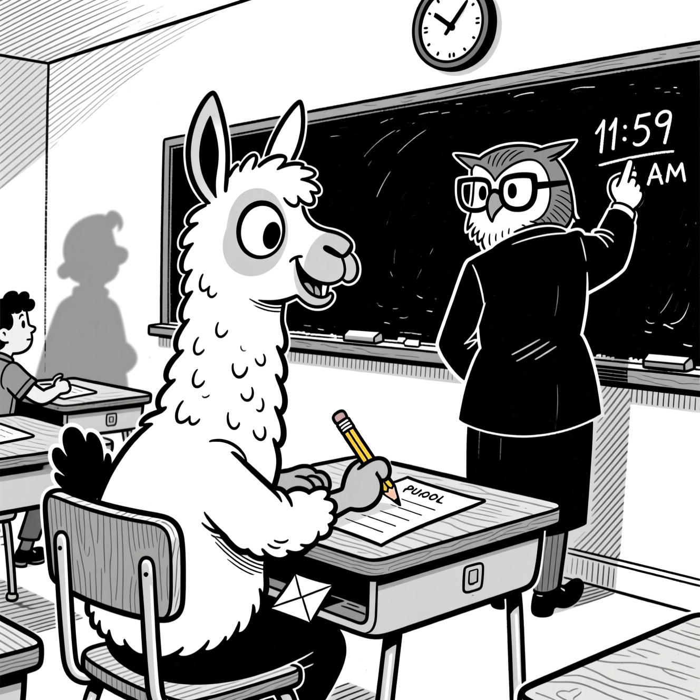

I've accumulated some knowledge and it's time to give back to the community. The knowledge was earned the old-fashioned way, but ramming my head into different machine learning walls whilst trying to adapt a Gemma3 model on my MBP M2 Max (96GB).

# First wall: MLX is amazing, but has very sharp edges

MLX runs noticeably faster than Pytorch on Apple Silicon, which is why apps like LM Studio use it as an inference engine alongside llama.cpp with GGUF. The `mlx-lm` project supports LoRA among many other goodies, so it's always my first stop. But there are two issues that always make me have to drop it, one chronic and one acute. 

The chronic issue is that if I'm writing MLX code I'm doing something novel and fun and probably need help. AI coding assistants are awful at helping with MLX. Codex hallucinates Pytorch code left right and centre until you give it a stern prompt, at which point it hallucinates MLX APIs that don't exist or are out of date. Not unusual for working with non-mainstream and AI.

The acute issue is that Gemma causes an internal error that crashes MLX. Awni of MLX is incredibly productive, but the issues ([1](https://github.com/ml-explore/mlx/issues/1363), [2](https://github.com/ml-explore/mlx-examples/issues/664)) have been open for over a year so I'm guessing it's a tough one to solve.

Either way, that about wraps it up for MLX if it happens to be Gemma that I want to train, which for this project I do. Gemma is great: convenient range of sizes, and its output passes the "vibe check", that intuition one develops to detect whether a model is actually strong or just benchmark-optimised.

{width=300}

# So you've decided to use Huggingface Transformers with MPS

Being back in the mainstream has its benefits; AI coders can comfortably generate training scripts and let you get on with the business of research rather than spending your time in low-level APIs. You'll have something up and running in no time at all.

And you'll think to yourself: damn, this is running really slowly. You start to dig, and you eventually hear about the significant performance gains of changing dtypes. Have you considered float16, or bfloat16? These are both faster than the default float32 and are supported by your system. It looks like a quick win.

# The illusion of bfloat16

The gist of bfloat16 is that it is smaller than float32 (so your models take up less memory and operations are faster) but with reduced precision. That's a tradeoff most people would be happy to make. But for a MPS on an M2 it's a dead end. No, worse than that, it's a road that secretly takes you the long way round back to float32. The M2 hardware and operating system supports bfloat16, but Pytorch's MPS backend doesn't fully support it so it often ends up quietly falling back to float32. In my most recent project it's been about 20% slower than float32, presumably because of the fallbacks. It was a surprise.

It's at this point that your AI assistant will suggest trying float16, which is also smaller than float32 but much more established.

# The outright con of float16

Whereas bfloat16 goes smaller than float32 by reducing precision, float16 goes smaller by reducing exponent range. This introduces overflow problems for some operations, which means casting up to float32 before calculating loss if you don't want to see `nan` everywhere. You can use autocasting to coax MPS to automatically select the right dtype for each operation, using the `torch.autocast` context manager. The conventional way to do this is to load in full precision and then cast down for the forward pass. You can also load in fp16 and cast up before calculating loss. It adds a little complexity to your training code, but that is very worth it for the reported speed ups of 1.3-1.6x!

If only. In fact it's slower by a similar multiple, [apparently due to a lack of optimisations and some internal conversions.](https://medium.com/@michael.hannecke/unleashing-apple-silicons-hidden-ai-superpower-a-technical-deep-dive-into-mps-accelerated-image-9573ba90570a)

I wasted a lot of time on assurances from Codex that this was an "easy win" only to find that after I fixed the exponent range issues, everything trained slower.

# A frustrating end

For this project I've ended up on bfloat16 with the Pytorch MPS backend. It's slower than float32, but the reduced model size in memory is helpful. It's frustrating, because I'm sure the hardware can do better, but I've already too much wasted time going in a circle. A smarter man would have ditched Gemma or fired up a VM to use CUDA; if I had known all of the above from the outset, those would have been more obvious choices.

So there you go. A lot of micro-lessons, I hope that some of them can spare you the same tribulations.