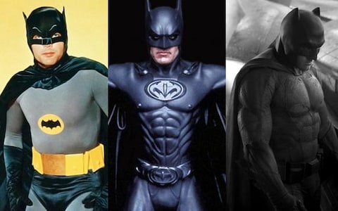
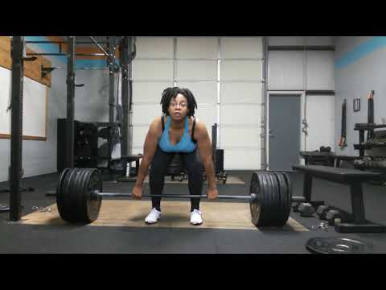
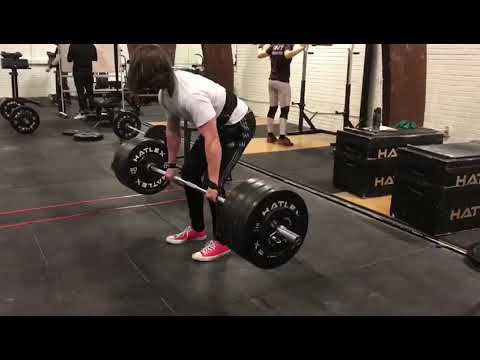
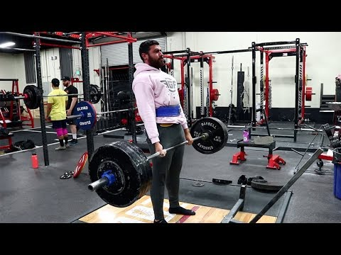

## About

**Me:** CTO at Polecat Intelligence, where we use AI to extract structured reputation risk insights from online media.

_Gymflation_ is nothing to do with Polecat, but we use these techniques regularly.

::: {.aside}
Blog post with all the code and data: [https://cbowdon.github.io/posts/gymflation](https://cbowdon.github.io/posts/gymflation)
:::

# Premise
Social media is distorting the perceived average strength level.

::: {.notes}
Much like it is distorting beauty standards, success standards, etc.
:::

## What is _gymflation_?

- An excuse to show you some LLM techniques.
- A phenomenon connected to social media's negative effects on self-image, which is increasingly leading to mental health issues such as body dysmorphia.
- Mostly the former though.

## Comparison to superhero inflation {.smaller}

:::: {.columns}
::: {.column width=50%}
"When I grow up, I want to be as strong as Batman" is less achievable now than it was in the 60s.
:::
::: {.column width=50%}

:::
::::

# Plan

## How can we investigate this?

Measure if feats of strength reported in online videos are increasing.

Taking a narrow definition of strength: deadlift personal record (PR) videos on YouTube.

:::: {.columns}

::: {.column width="30%"}

:::

::: {.column width="30%"}

:::

::: {.column width="30%"}

:::

::::

Questions:

1. Is the average reported deadlift PR weight increasing over time?
2. Are the number of reported heavy deadlift PRs increasing over time?

::: {.notes}
- Deadlifting is the method that lets one lift the most weight, so it's a point of pride for many lifters.
- Typically people will report the maximum weight that they can lift for one repetition.
- I say "questions" rather than "hypotheses" because we're not doing science here, we're playing.
:::

## Steps

- Scrape the YouTube API for 10 years of deadlift personal record (PR) videos with httr2
- Use structured responses to extract the lifted weight with an LLM
- Evaluate the quality of our extraction and improve it with In-Context Learning (ICL)
- Use a multimodal model to judge the lifter's gender
- Make extensive use of caching so errors don't set us back
- Plot our results with good old ggplot2

# Data gathering

## YouTube API {.smaller}

We can use httr2 for this.

```{r}
#| label: youtube
library(httr2)

req <- request("https://youtube.googleapis.com/youtube/v3/search") |>
  req_cache(".cache/httr2") |> # <1>
  req_url_query(
    part = "snippet",
    q = query,
    type = "video",
    maxResults = 50,
    duration = "short",
    region = "UK",
    published_after = published_after,
    published_before = published_before,
    key = YOUTUBE_API_KEY
  ) |>
  req_headers(Accept = "application/json") |>
  req_timeout(30)

req_perform(req) |> # <2>
  resp_body_json(simplifyVector = TRUE) # <3>
```

1. Client-side caching saves you from wasting time or request quota.
2. Other useful methods include `req_dry_run` and `req_perform_parallel`.
3. Getting data back as a dataframe is very convenient, so I recommend `simplifyVector = TRUE`.

## Data

```{r}
#| label: tbl-raw-data
#| tbl-cap: Sample of the raw data from the YouTube API.
#| cap-location: bottom
#| eval: true
#| echo: false
library(knitr)
library(tidyverse)
set.seed(42)
df <- readRDS("data/youtube_df.rds")
df |>
  slice_sample(n = 5) |>
  select(
    id.videoId,
    publishedAt,
    channelTitle,
    title,
    description,
    thumbnails.high.url
  ) |>
  kable()
```

Regular expressions wouldn't be sufficient here...

# Model 1: fact extraction
Using an LLM to extract the weights from the messy text.

## Structured responses {.smaller}

```{r}
#| label: structured-response-model
#| eval: true
library(ellmer)

LLM_SERVER_URL <- "http://localhost:8080/v1" # <1>

system.prompt <- "The user will provide the title and description of a YouTube video. If they describe a weight being deadlifted, you must extract the weight that was deadlifted, with the unit, and the number of repetitions.

Note that the deadlift world record is currently 510kg/1122lb.
Return only a JSON object with keys:

- `weight` (numeric)
- `unit` (kg, lb or NA)
- `reps` (numeric, assume 1 if not provided). 

Do not perform unit conversion.
Return NA as the unit if the description doesn't mention a weight deadlifted or the unit isn't clear."

extract_dl_weight_model <- function() {
  chat_openai_compatible(
    LLM_SERVER_URL,
    model = "mistralai/ministral-3-3b", # <2>
    credentials = function() "", # not used - local model
    params = params(max_tokens = 50), # don't generate more than we need
    system_prompt = system.prompt
  )
}

extract.dl.weight.type <- type_object(
  weight = type_number("The weight deadlifted, as a number."),
  unit = type_enum(values = c("kg", "lb", "NA")),
  reps = type_integer("Number of repetitions (1 if unspecified)")
) # <3>
```

1. Local caching proxy
2. A small open source model, running on my laptop via LM Studio
3. The response structure definition

::: {.notes}
Structured generation is dead simple conceptually: at each generation step, instead of sampling from all possible tokens, sample only from legal tokens.

If we only prompted the LLM to return JSON in our desired format, but didn't restrict its outputs, it would _mostly_ return the right format. Structured generation makes this reliable. It's usually best to keep the format instructions in the prompt though, so we get sensible probabilities on the legal tokens.
:::

## Example structured response

```{r}
#| label: example-structured-response
#| eval: true
extract_dl_weight_model()$chat_structured(
  "Title: 665 lbs deadlift at 188 lbs bodyweight #deadlift #pr #powerlifting #powerlifter #usapl #ipf #shortsfeed\nDescription: ",
  type = extract.dl.weight.type
) |>
  as_tibble() |>
  kable()
```

::: {.notes}
- Need to perform 2 conversions: Imperial -> Metric, and Epley 1 rep max calculation
- But most importantly, how can we trust this?
:::

## Evaluating our model

- AI is _jagged intelligence_: screws up in unexpected ways
- Need to measure its performance
- Build high-quality test set and score accuracy (dev + test) ^[Manually annotated] 
- This model so far: **73%** accurate in its extractions
- Let's open the model optimisation toolbox!

::: {.notes}
One of the techniques I considered showing you was getting a very large model to annotate your test set. But it's TURTLES ALL THE WAY DOWN, because you need to be confident in the large model's accuracy first.

Are you familiar with the concept of a dev set and a held out test set?
:::

## In-Context Learning (ICL) {.smaller}

:::: {.columns}

::: {.column width="50%"}

```{r}
#| label: icl-model
extract_dl_weight_model <- function(turns = list()) {
  chat <- chat_openai_compatible(
    LLM_SERVER_URL,
    model = "mistralai/ministral-3-3b",
    credentials = function() "", # not used - local model
    params = params(max_tokens = 50), # don't generate more than we need
    system_prompt = system.prompt
  )
  chat$set_turns(turns)
  chat
}

example_turn_pair <- function(title, description, weight, unit, reps) {
  list(
    UserTurn(list(ContentText(
      interpolate("Title: {{title}}\nDescription: {{description}}")
    ))),
    AssistantTurn(list(ContentText(
      interpolate(
        "{\"weight\":{{weight}}, \"unit\":\"{{unit}}\", \"reps\":{{reps}}}"
      )
    )))
  )
}
```
A.k.a. "few-shot learning", the idea is you condition the LLM on example inputs and outputs.

Here I've hand-crafted some examples based on dev failures.

New result: **92%** extraction accuracy on test.

:::
::: {.column width="50%"}
```{r}
#| label: icl-examples
turns <- c(
  example_turn_pair(
    title = "deadlift PR 220 @ 165 bodyweight",
    description = "hit this at my meet",
    weight = 220,
    unit = "NA",
    reps = 1
  ),
  example_turn_pair(
    title = "NEW PR 585",
    description = "new deadlift personal record",
    weight = 585,
    unit = "NA",
    reps = 1
  ),
  example_turn_pair(
    title = "NEW PR 330x3",
    description = "",
    weight = 330,
    unit = "NA",
    reps = 3
  ),
  example_turn_pair(
    title = "180kg x 3 deadlift PR",
    description = "81kg 18 years old.",
    weight = 180,
    unit = "kg",
    reps = 3
  ),
  example_turn_pair(
    title = "100kg/220lb deadlift PR",
    description = "smashed it",
    weight = 100,
    unit = "kg",
    reps = 1
  ),
  example_turn_pair(
    title = "365 lb Deadlift PR @ 165 lbs",
    description = "Christal hitting a new deadlift PR @ 365 lbs, beltless. And before anyone says anything about her form, her deadlift PRs have ...",
    weight = 365,
    unit = "lb",
    reps = 1
  )
)
```
:::
::::

::: {.notes}
With reasoning models this technique is less useful than it was, and sometimes even detrimental because the LLM over-conditions. It's always necessary to evaluate.
:::

# First look at the data

```{r}
#| label: fig-data
#| fig-cap: Deadlift PRs reported by YouTube users over time. World record lifts are points overlaid in orange. The dashed horizontal lines are round-number Imperial weights (100-1000lbs).
#| echo: false
#| eval: true
full.weights.file <- "data/full-weights.rds"
df.weights <- readRDS(full.weights.file) |>
  # The extraction assigns -1 for any invalid weights, drop them now.
  filter(weight.kg.1rm > 0) |>
  # Any weight above 600 is well above the current world record, and either an extraction error or a silly post.
  filter(weight.kg.1rm < 600)

world.records <- read_csv("data/deadlifts.csv") |>
  mutate(weight.kg.1rm = kg, publish.date = parse_date(date, format = "%b %Y"))

hline <- function(yint.kg) {
  geom_hline(
    aes(yintercept = yint.kg),
    alpha = 0.5,
    linetype = "dashed",
    colour = "grey"
  )
}

ggplot(df.weights) +
  aes(x = publish.date, y = weight.kg.1rm) +
  geom_point(alpha = 0.9, size = 1) +
  geom_smooth() +
  geom_point(data = world.records, size = 2, colour = "orange") +
  geom_text(
    data = world.records,
    mapping = aes(label = athlete),
    nudge_y = 10,
    check_overlap = TRUE
  ) +
  hline(100 / 2.2) +
  hline(200 / 2.2) +
  hline(300 / 2.2) +
  hline(400 / 2.2) +
  hline(500 / 2.2) +
  hline(600 / 2.2) +
  hline(700 / 2.2) +
  hline(800 / 2.2) +
  hline(900 / 2.2) +
  hline(1000 / 2.2) +
  labs(x = "Date", y = "1RM weight (kg)")
```

::: {.notes}
- Pleasingly normal distribution
- Some suspicious reports
- Expect some clumping on round numbers, similar to the 6ft height effect
:::

# Model 2: image classification

Male and female lifters have different strength distributions. Changes in one could mask changes in the other.

## Image classification model {.smaller}

```{r}
#| label: gender-classifier-model
#| eval: true
gender.classifier.prompt <- "The user will provide a YouTube video thumbnail of a deadlift PR. You must predict the gender of the person lifting the weight using the image and the video metadata (channel and title).
  Respond with `M` if the person appears male or `F` if the person appears female. If no real human is visible enough or if there are multiple people lifting the weight, respond with `NA`.
  Return your answer in a JSON object with a single key `gender` with value `M`, `F` or `NA`."

predict_gender_chat <- function(model = "mistralai/ministral-3-3b") {
  # <1>
  chat_openai_compatible(
    LLM_SERVER_URL,
    model = model,
    credentials = function() "",
    params = params(max_tokens = 1000),
    system_prompt = gender.classifier.prompt
  )
}

predict.gender.type <- type_object(
  gender = type_enum(values = c("M", "F", "NA"))
)

img_prompt <- function(row) {
  list(
    sprintf(
      "YouTube Channel: %s\nVideo title: %s",
      row$channelTitle,
      row$title
    ),
    content_image_file(row$image.path) # <2>
  )
}
```

1. Ministral 3 3B is capable of understanding images too.
2. We can provide both text and an image file in a single turn.

## Example usage

```{r}
#| label: example-image-model-usage
prompt <- img_prompt(df.weights.imgs[1, ])
chat <- predict_gender_chat()
chat$chat_structured(
  prompt[[1]],
  prompt[[2]],
  type = predict.gender.type
)
#chat$get_tokens()
```

## Evaluating our image model

- Another cycle of dataset annotation, evaluation and optimisation.
- This time I've vibe-coded an annotation UI.
- {height=500}

::: {.notes}
- Though the code for this UI is absolutely disposable, it's absolutely worth your time designing a UI that minimises cognitive load, is efficient to manipulate, and doesn't lead to mistakes.
:::

## Model search {.smaller}

The model scores 77% accuracy on the balanced evaluation set. Let's see if money can buy better results.

```{r}
#| label: chat-or
chat_or <- function(model) {
  chat_openrouter(
    model = model,
    system_prompt = gender.classifier.prompt,
    api_headers = c(
      `X-OpenRouter-Cache` = "true", # <1>
      `X-OpenRouter-Cache-TTL` = 86400 # can cache up to 24 hours
    ),
    api_args = list(
      reasoning = list(enabled = TRUE) # <2>
    )
  )
}

chat.gem <- chat_or("google/gemini-3.1-flash-lite-preview") # <3>

prompt <- img_prompt(df.weights.imgs[2, ])
chat.gem$chat_structured(prompt[[1]], prompt[[2]], type = predict_gender_type)
```

1. `chat_openrouter` doesn't accept `base_url` for the proxy, but we can enable experimental response caching from OpenRouter itself.
2.  We must explicitly enable reasoning.
3. The best model in our budget.

Gemini 3.1 Flash Lite Preview scores 87% on the evaluation set, huzzah. But will it cost the earth?

```{r}
#| label: chat-cost
chat_cost <- function(chat) {
  last.turn <- chat$last_turn()
  last.turn@json$usage$cost # <1>
}
```

::: {.notes}
The predicted cost was approx. 2 USD, which is good because my budget was $10 and I expected to screw up at least 4 times.

I've skipped over the bit where I evaluated a range of models. It's fairly mechanical though.
:::

1. Ellmer's `chat$get_cost()` doesn't always work, but you can get at it via the raw JSON.

# Second look at the data

:::: {.columns}
::: {.column width="50%"}
```{r}
#| label: fig-gender-dist
#| fig-cap: The distribution of deadlift 1RM weights by gender - clearly different.
#| eval: true
#| echo: false
df.weights.genders <- readRDS("data/gender-labelled-full.rds")

gender.colours <- c("orange", "purple")
ggplot(df.weights.genders |> drop_na(gender, weight.kg.1rm)) +
  aes(x = weight.kg.1rm, fill = gender) +
  scale_fill_manual(values = gender.colours) +
  geom_histogram(alpha = 0.5) +
  labs(x = "1RM weight (kg)", y = "Videos posted", fill = "Gender")
```
:::
::: {.column width="50%"}

```{r}
#| label: fig-gender-time
#| fig-cap: Female lifters are still the minority, but have arguably improved relative to male lifters.
#| eval: true
#| echo: false
ggplot(df.weights.genders |> drop_na(gender, weight.kg.1rm)) +
  aes(x = publish.date, y = weight.kg.1rm, group = gender, colour = gender) +
  geom_point(alpha = 0.5, size = 0.5) +
  geom_smooth() +
  scale_colour_manual(values = gender.colours) +
  labs(x = "Date", y = "1RM weight (kg)", colour = "Gender")
```
:::
::::


# Summing up {.smaller}

We looked at:

- Some tricks for scraping data from the YouTube API with `httr2`
- Using structured responses with `Ellmer` to extract data with LLMs
- How to use ICL to improve our LLM extraction model
- How to do image classification with VLMs
- Building an evaluation set with a vibe-coded annotator UI
- Finding a better model on OpenRouter
- I hope you weren't too invested in the gymflation idea itself

Blog post with all the code and data: [https://cbowdon.github.io/posts/gymflation](https://cbowdon.github.io/posts/gymflation)